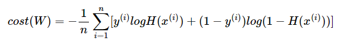

# 이진 분류
- 이번 로지스틱 회귀의 가설은 선형 회귀 때의 H(x) = Wx + b가 아니라, S자 모양의 그래프를 만들 수 있는 어떤 특정 함수 f를 추가적으로 사용하여 H(x) = f(Wx + b)의 가설을 사용. 이를 시그모이드 함수라고 함.

# 시그모이드 함수
- 시그모이드 함수는 입력값이 한없이 커지면 1에 수렴하고, 입력값이 한없이 작아지면 0에 수렴함.
- 시그모이드 함수의 출력값은 0과 1 사이의 값을 가지는데 이 특성을 이용하여 분류 작업에 사용할 수 있음.

# 비용 함수
- 시그모이드 함수의 비용 함수는 평균 제곱 오차를 이용하면 전체 함수에 걸쳐 최소값인 글로벌 미니멈이 아닌 특정 구역에서의 최소값인 로컬 미니멈에 도달할 수 도 있음.
- 그렇기에 함수의 출력값이 0과 1사이의 값이라는 특징을 이용하여 로그 함수로 부터 오차 평균을 도출함. 

# 인공 신경망
- 사실 로지스틱 회귀는 인공 신경망으로 간주할 수 있음.
- 시그모이드 함수는 인공 신경망의 은닉층에서는 거의 사용되지 않음.

# 모델을 클래스로 구현
- 대부분의 파이토치 구현체에서 클래스를 사용하여 모델을 구현함.
