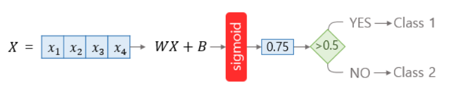
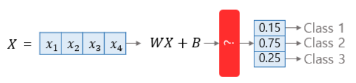
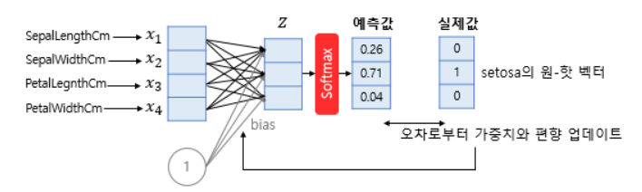
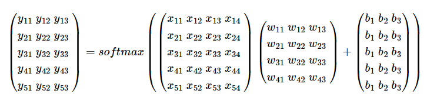
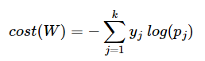

# 원-핫 인코딩
- 원-핫 인코딩은 선택해야 하는 선택지의 개수만큼의 차원을 가지면서, 각 선택지의 인덱스에 해당하는 원소에는 1, 나머지 원소는 0의 값을 가지도록 하는 표현 방법임.
- 강아지 = [1, 0, 0]
- 고양이 = [0, 1, 0]
- 냉장고 = [0, 0, 1]
- 반적인 분류 문제에서는 각 클래스는 순서의 의미를 갖고 있지 않으므로 각 클래스 간의 오차는 균등한 것이 옳음. 정수 인코딩과 달리 원-핫 인코딩은 분류 문제 모든 클래스 간의 관계를 균등하게 분배함.

# 다중 클래스 분류
- 이진 분류가 두 개의 답 중 하나를 고르는 문제였다면, 세 개 이상의 답 중 하나를 고르는 문제를 다중 클래스 분류(Multi-class Classification)라고 함.
- 로지스틱 회귀에서 시그모이드 함수는 예측값을 0과 1 사이의 값으로 만듬.

- 소프트맥스 회귀는 확률의 총 합이 1이 되는 이 아이디어를 다중 클래스 분류 문제에 적용함. 소프트맥스 회귀는 각 클래스. 즉, 각 선택지마다 소수 확률을 할당함. 이때 총 확률의 합은 1이 되어야 함. 이렇게 되면 각 선택지가 정답일 확률로 표현됨.

# 소프트맥스 함수
- 소프트맥스 함수는 분류해야하는 정답지(클래스)의 총 개수를 k라고 할 때, k차원의 벡터를 입력받아 각 클래스에 대한 확률을 추정함.

- 크기 5 × 3의 행렬 Y^는 크기 5 × 4 입력 행렬 X과 가중치 행렬 W의 곱으로 얻어지는 행렬이므로 가중치 행렬 W의 크기는 추정을 통해 4 × 3의 크기를 가진 행렬임을 알 수 있음.
- 편향 행렬 B는 예측값 행렬 Y^와 크기가 동일해야 하므로 5 × 3의 크기를 가짐.

# 비용 함수
- 소프트맥스 회귀에서는 비용 함수로 크로스 엔트로피 함수를 사용함.

