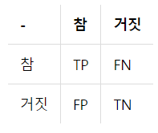

# 데이터
- 전체 데이터 = 훈련 + 검증 + 테스트
- 검증용 데이터는 모델의 성능을 평가하기 위한 용도가 아니라, 모델의 성능을 조정하기 위한 용도. 더 정확히는 과적합이 되고 있는지 판단하거나 하이퍼파라미터의 조정을 위한 용도임.
- 하이퍼파라미터(초매개변수)란 값에 따라서 모델의 성능에 영향을 주는 매개변수들을 말함. 반면, 가중치와 편향과 같은 학습을 통해 바뀌어져가는 변수를 매개변수라고 부름.
- 하이퍼파라미터는 보통 사용자가 직접 정해줄 수 있는 변수. 매개변수는 사용자가 결정해주는 값이 아니라 모델이 학습하는 과정에서 얻어지는 값.

# 분류와 회귀
- 이진 분류는 주어진 입력에 대해서 둘 중 하나의 답을 정하는 문제.
- 다중 클래스 분류는 주어진 입력에 대해서 세 개 이상의 정해진 선택지 중에서 답을 정하는 문제.
- 회귀 문제는 분류 문제처럼 0 또는 1이나 과학 책장, IT 책장 등과 같이 분리된(비연속적인) 답이 결과가 아니라 연속된 값을 결과로 가짐.

# 지도 학습과 비지도 학습
- 지도 학습이란 레이블(Label)이라는 정답과 함께 학습하는 것을 말함.
- 비지도 학습은 기본적으로 목적 데이터(또는 레이블)이 없는 학습 방법.
- 강화 학습은 어떤 환경 내에서 정의된 에이전트가 현재의 상태를 인식하여, 선택 가능한 행동들 중 보상을 최대화하는 행동 혹은 행동 순서를 선택하는 방법.

# 혼동 행렬
- 머신 러닝에서는 맞춘 문제수를 전체 문제수로 나눈 값을 정확도(Accuracy)라고 함. 하지만 정확도는 맞춘 결과와 틀린 결과에 대한 세부적인 내용을 알려주지는 않음. 이를 위해서 사용하는 것이 혼동 행렬(Confusion Matrix).
- 성(Positive)과 음성(Negative)을 구분하는 이진 분류가 있다고 하였을 때 혼동 행렬은 다음과 같음.
  

- 정밀도은 양성이라고 대답한 전체 케이스에 대한 TP의 비율.

- 재현률은 실제값이 양성인 데이터의 전체 개수에 대해서 TP의 비율임. 즉, 양성인 데이터 중에서 얼마나 양성인지를 예측(재현)했는지를 나타냄.

# 과적합과 과소 적합
- 과적합(Overfitting)이란 훈련 데이터를 과하게 학습한 경우를 말함. 
- 예를 들어 강아지 사진과 고양이 사진을 구분하는 기계가 있을 때, 검은색 강아지 사진 훈련 데이터를 과하게 학습하면 기계는 나중에 가서는 흰색 강아지나, 갈색 강아지를 보고도 강아지가 아니라고 판단하게 되는데, 이는 훈련 데이터에 대해서 지나친 일반화를 한 상황임.
- 과적합 상황에서는 훈련 데이터에 대해서는 오차가 낮지만, 테스트 데이터에 대해서는 오차가 높아지는 상황이 발생함.

- 과적합 방지를 위해 테스트 데이터의 성능이 낮아지기 전에 훈련을 멈추는 것이 바람직하다고 했는데, 테스트 데이터의 성능이 올라갈 여지가 있음에도 훈련을 덜 한 상태를 반대로 과소적합(Underfitting)이라고함.
- 소 적합은 훈련 자체가 부족한 상태이므로 과대 적합과는 달리 훈련 데이터에 대해서도 보통 정확도가 낮다는 특징이 있음.

# 퍼셉트론
- x는 입력값을 의미하며, W는 가중치(Weight), y는 출력값입니다. 그림 안의 원은 인공 뉴런에 해당됨. 실제 신경 세포 뉴런에서의 신호를 전달하는 축삭돌기의 역할을 퍼셉트론에서는 가중치가 대신함. 각각의 인공 뉴런에서 보내진 입력값 x는 각각의 가중치 W와 함께 종착지인 인공 뉴런에 전달되고 있음. 편향 b도 포함됨.

- 각 입력값이 가중치와 곱해져서 인공 뉴런에 보내지고, 각 입력값과 그에 해당되는 가중치의 곱의 전체 합이 임계치(threshold)를 넘으면 종착지에 있는 인공 뉴런은 출력 신호로서 1을 출력하고, 그렇지 않을 경우에는 0을 출력. 러한 함수를 계단 함수(Step function)라고 함.

# 다중 퍼셉트론
- 다층 퍼셉트론과 단층 퍼셉트론의 차이는 단층 퍼셉트론은 입력층과 출력층만 존재하지만, 다층 퍼셉트론은 중간에 층을 더 추가하였다는 점임. 이렇게 입력층과 출력층 사이에 존재하는 층을 은닉층(hidden layer)이라고 함.  다층 퍼셉트론은 줄여서 MLP라고도 부름.
- 은닉층이 2개 이상인 신경망을 심층 신경망(Deep Neural Network, DNN)이라고 함. 심층 신경망은 다층 퍼셉트론만 이야기 하는 것이 아니라, 여러 변형된 다양한 신경망들도 은닉층이 2개 이상이 되면 심층 신경망이라고 함.

# 순전파
- 각 입력은 입력층에서 은닉층 방향으로 향하면서 각 입력에 해당하는 가중치와 곱해지고, 결과적으로 가중합으로 계산되어 은닉층 뉴런의 시그모이드 함수의 입력값이 됨. 이를 출력층 뉴런까지 진행.
- 오차(Error)를 계산하기 위한 손실 함수(Loss function)로는 평균 제곱 오차 MSE를 사용함.

# 역전파
- 순전파가 입력층에서 출력층으로 향한다면 역전파는 반대로 출력층에서 입력층 방향으로 계산하면서 가중치를 업데이트해감. 출력층 바로 이전의 은닉층을 N층이라고 하였을 때, 출력층과 N층 사이의 가중치를 업데이트하는 단계를 역전파 1단계, 그리고 N층과 N층의 이전층 사이의 가중치를 업데이트 하는 단계를 역전파 2단계라고 해봄.

# 비선형 함수
- 선형 함수로는 은닉층을 여러번 추가하더라도 1회 추가한 것과 차이를 줄 수 없음. 활성화 함수를 사용하는 일반적인 은닉층을 선형층과 대비되는 표현을 사용하면 비선형층(nonlinear layer).

# 시그모이드 함수와 기울기 소실
- 시그모이드 함수의 출력값이 0 또는 1에 가까워지면, 그래프의 기울기가 완만해지는 구간이 존재. 전파 과정에서 0에 가까운 아주 작은 기울기가 곱해지게 되면, 앞단에는 기울기가 잘 전달되지 않게 됩니다. 이러한 현상을 기울기 소실(Vanishing Gradient) 문제라고 함.
- 시그모이드 함수를 사용하는 은닉층의 개수가 다수가 될 경우에는 0에 가까운 기울기가 계속 곱해지면 앞단에서는 거의 기울기를 전파받을 수 없게 됨. 다시 말해 매개변수 W가 업데이트 되지 않아 학습이 되지를 않음.
  
# 하이퍼볼릭탄젠트 함수
- 하이퍼볼릭탄젠트 함수(tanh)는 입력값을 -1과 1사이의 값으로 변환
- 하이퍼볼릭탄젠트 함수도 -1과 1에 가까운 출력값을 출력할 때, 시그모이드 함수와 같은 문제가 발생함. 그러나 하이퍼볼릭탄젠트 함수의 경우에는 시그모이드 함수와는 달리 0을 중심으로 하고 있는데, 이때문에 시그모이드 함수와 비교하면 반환값의 변화폭이 더 큼. 그래서 시그모이드 함수보다는 기울기 소실 증상이 적은 편임.
- 은닉층에서 시그모이드 함수보다는 많이 사용됨

# 렐루 함수
- 렐루 함수는 음수를 입력하면 0을 출력하고, 양수를 입력하면 입력값을 그대로 반환함. 단순 임계값이므로 연산 속도가 빠름.
- 특정 양수값에 수렴하지 않으므로 깊은 신경망에서 시그모이드 함수보다 훨씬 더 잘 작독함.
- 입력값이 음수면 기울기도 0이 되고 이 뉴런은 다시 회생하는 것이 매우 어려움. 이를 죽은 렐루라고 함

# 리키 렐루 함수
- 입력값이 음수일 경우에 0이 아니라 0.001과 같은 매우 작은 수를 반환하도록 되어있음.
- 입력값이 음수라도 기울기가 0이 되지 않으면 ReLU는 죽지 않음.

# 소프트맥스 함수
- 분류 문제를 로지스틱 회귀와 소프트맥스 회귀를 출력층에 적용하여 사용함.
- 세 가지 이상의 (상호 배타적인) 선택지 중 하나를 고르는 다중 클래스 분류(MultiClass Classification) 문제에 주로 사용.

# 출력층의 활성화 함수

# 과적합 막기
- 학습 데이터에 모델이 과적합되는 현상은 모델의 성능을 떨어트리는 주요 이슈임. 모델이 과적합되면 훈련 데이터에 대한 정확도는 높을지라도, 새로운 데이터. 즉, 검증 데이터나 테스트 데이터에 대해서는 제대로 동작하지 않음. 
- 모델의 과적합을 막는 방법은 여러 가지가 있음.

# 데이터 양 늘리기
- 모델은 데이터의 양이 적을 경우, 해당 데이터의 특정 패턴이나 노이즈까지 쉽게 암기하기 되므로 과적합 현상이 발생할 확률이 늘어남. 그렇기 때문에 데이터의 양을 늘릴 수록 모델은 데이터의 일반적인 패턴을 학습하여 과적합을 방지할 수 있음.
- 데이터의 양이 적을 경우에는 의도적으로 기존의 데이터를 조금씩 변형하고 추가하여 데이터의 양을 늘리기도 하는데 이를 데이터 증식 또는 증강(Data Augmentation)이라고 함.
- 이미지의 경우 데이터 증식이 많이 사용됨.

# 모델 복잡도 줄이기
- 인공 신경망의 복잡도는 은닉층(hidden layer)의 수나 매개변수의 수 등으로 결정됨.
- 과적합 현상이 포착되었을 때, 인공 신경망 모델에 대해서 할 수 있는 한 가지 조치는 인공 신경망의 복잡도를 줄이는 것임.

# 가중치 규제 적용
- 복잡한 모델이 간단한 모델보다 과적합될 가능성이 높음. 복잡한 모델을 좀 더 간단하게 하는 방법으로 가중치 규제(Regularizaiton)가 있음.
- L1 규제 : 가중치 w들의 절대값 합계를 비용 함수에 추가합니다. L1 노름이라고도 함.
- L2 규제 : 모든 가중치 w들의 제곱합을 비용 함수에 추가합니다. L2 노름이라고도 함.
- 파이토치에서는 옵티마이저의 weight_decay 매개변수를 설정하므로서 L2 규제를 적용함. weight_decay 매개변수의 기본값은 0임.

# 드롭아웃
- 드롭아웃은 학습 과정에서 신경망의 일부를 사용하지 않는 방법임.
- 드롭아웃은 신경망 학습 시에만 사용하고, 예측 시에는 사용하지 않는 것이 일반적임.

# 기울기 소실
-  입력층에 가까운 층들에서 가중치들이 업데이트가 제대로 되지 않으면 결국 최적의 모델을 찾을 수 없게 됨. 이를 기울기 소실(Gradient Vanishing)이라고 함.
-  기울기가 점차 커지더니 가중치들이 비정상적으로 큰 값이 되면서 결국 발산되기도 합니다. 이를 기울기 폭주(Gradient Exploding)이라고 함.

# ReLU와 ReLU 변형들
- 기울기 소실을 완화하는 가장 간단한 방법은 은닉층의 활성화 함수로 시그모이드나 하이퍼볼릭탄젠트 함수 대신에 ReLU나 ReLU의 변형 함수와 같은 Leaky ReLU를 사용하는 것임.
- 은닉층에서는 시그모이드 함수를 사용하지 말 것.
- Leaky ReLU를 사용하면 모든 입력값에 대해서 기울기가 0에 수렴하지 않아 죽은 ReLU 문제를 해결함.
- 은닉층에서는 ReLU나 Leaky ReLU와 같은 ReLU 함수의 변형들을 사용할 것.

# 가중치 초기화
- 가중치 초기화만 적절히 해줘도 기울기 소실 문제과 같은 문제를 완화시킬 수 있음.
- 세이비어 초기화. He 초기화

# 세이비어 초기화
- 균등 분포(Uniform Distribution) 또는 정규 분포(Normal distribution)로 초기화 할 때 두 가지 경우로 나뉘며, 이전 층의 뉴런 개수와 다음 층의 뉴런 개수를 가지고 식을 세움.
- 세이비어 초기화는 시그모이드 함수나 하이퍼볼릭 탄젠트 함수와 같은 S자 형태인 활성화 함수와 함께 사용할 경우에는 좋은 성능을 보이지만, ReLU와 함께 사용할 경우에는 성능이 좋지 않음.

# He 초기화
- He 초기화(He initialization)는 세이비어 초기화와 유사하게 정규 분포와 균등 분포 두 가지 경우로 나눔. 다만, He 초기화는 세이비어 초기화와 다르게 다음 층의 뉴런의 수를 반영하지 않음.
- 시그모이드 함수나 하이퍼볼릭탄젠트 함수를 사용할 경우에는 세이비어 초기화 방법이 효율적임.
- ReLU 계열 함수를 사용할 경우에는 He 초기화 방법이 효율적임.
- ReLU + He 초기화 방법이 좀 더 보편적임.

# 배치 정규화
- ReLU 계열의 함수와 He 초기화를 사용하는 것만으로도 어느 정도 기울기 소실과 폭주를 완화시킬 수 있지만, 이 두 방법을 사용하더라도 훈련 중에 언제든 다시 발생할 수 있음.
- 배치 정규화는 인공 신경망의 각 층에 들어가는 입력을 평균과 분산으로 정규화하여 학습을 효율적으로 만듬.
- 미니 배치 크기에 의존적. RNN에 적용하기 어려움.