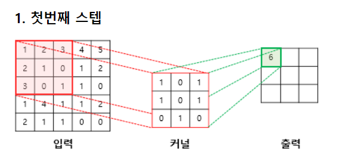
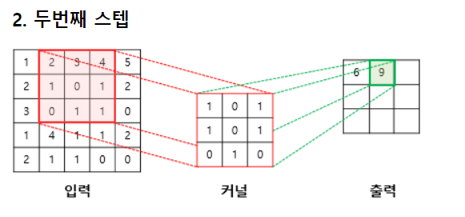
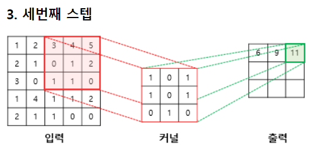
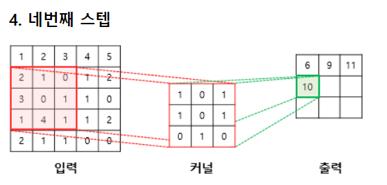
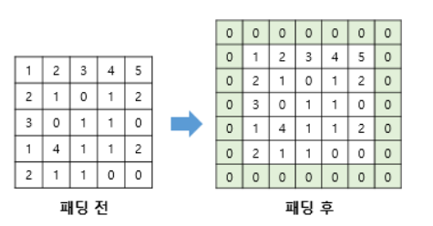
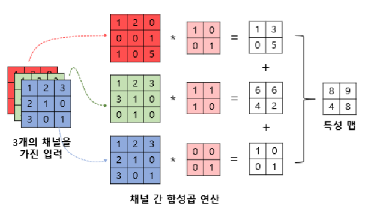

# 합성곱 신경망의 대두
- 기존 다층 퍼셉트론으로 분류한다면 1차원 텐서로 바꾸어 입력층으로 사용하게 되는데, 이는 공간적인 구조 정보가 유실됨.
- 결국 공간적인 구조 정보를 보존하면서 학습 할 필요가 있고, 그 방법이 합성곱 신경망

# 채널
- 이미지는 (높이, 너비, 채널)이라는 3차원 텐서.
- 컬러 이미지는 적색(Red), 녹색(Green), 청색(Blue) 채널 수가 3개.

# 합성곱 연산
- 합성곱층은 합성곱 연산을 통해서 이미지의 특징을 추출하는 역할을 함.
- 아래는  3 x 3 크기의 커널로 5 x 5 의 이미지 행렬에 합성곱 연산을 수행하는 과정을 보여줌.

- 위와 같이 입력으로부터 커널을 사용하여 합성곱 연산을 통해 나온 결과를 특성 맵(feature map)이라고 함.
- 커널의 이동 범위가 위의 예제에서는 한 칸이었지만, 이 또한 사용자가 정할 수 있음. 이러한 이동 범위를 스트라이드(stride)라고 함.

# 패딩
- 합성곱 연산의 결과로 얻은 특성 맵은 입력보다 크기가 작아진다는 특징이 있음.
- 합성곱 연산 이후에도 특성 맵의 크기가 입력의 크기와 동일하게 유지되도록 하고 싶다면 패딩(padding)을 사용.

# 가중치와 편향
- 합성곱 신경망에서 가중치는 커널 행렬의 원소들임.
- 최종적으로 특성 맵을 얻기 위해서는 동일한 커널로 이미지 전체를 훑으며 합성곱 연산을 진행함.
- 합성곱 신경망은 다층 퍼셉트론을 사용할 때보다 훨씬 적은 수의 가중치를 사용하며 공간적 구조 정보를 보존한다는 특징이 있음.
- 편향을 사용한다면 커널을 적용한 뒤에 더해짐. 편향은 하나의 값만 존재하며, 커널이 적용된 결과의 모든 원소에 더해짐.

# 다수의 채널을 가질 경우의 합성곱 연산
- 입력 데이터의 채널 수와 커널의 채널 수는 같아야 하고, 채널 수가 같으므로 합성곱 연산을 채널마다 수행함. 그리고 그 결과를 모두 더하여 최종 특성 맵을 얻음.

# 폴링
- 일반적으로 합성곱 층(합성곱 연산 + 활성화 함수) 다음에는 풀링 층을 추가하는 것이 일반적.
- 링 연산에는 일반적으로 최대 풀링(max pooling)과 평균 풀링(average pooling)이 사용됨.
- 맥스 풀링은 커널과 겹치는 영역 안에서 최대값을 추출하는 방식으로 다운샘플링함.
- 평균 풀링은 최대값을 추출하는 것이 아니라 평균값을 추출하는 연산임.